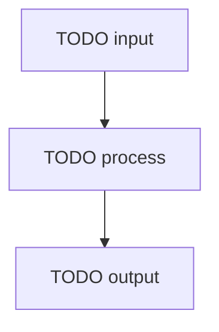

<!--
Copyright (c) 2025 Martin Bechard [martin.bechard@DevConsult.ca]
This software is licensed under the MIT License.
File path: skills/route-documentation-work/assets/templates/module-design-template.md
1-line summary: Template for one-module design documentation.
-->

# TODO Module Name Design

## Current Understanding

> This gives implementers, test authors, and reviewers a shared baseline for the module before they interpret detailed contracts. Module designers, implementers, test authors, and reviewers use it during assignment, onboarding, and review to state the module's purpose, single responsibility, current or intended behavior, and design mode.

TODO: Describe what this module does and why the project needs it.

TODO: State the single primary responsibility of the module.

TODO: State whether this module design describes existing behavior, intended behavior, or a known mix of both.

TODO: State the selected design mode: PLANNED_DEVELOPMENT, EXISTING_IMPLEMENTATION, or MIXED_CHANGE.

## Authoritative Sources

> This lets reviewers distinguish accepted module contracts from inference and apply source precedence at the correct level of specificity. Module designers, implementers, test authors, and reviewers use it during design and maintenance to link parent requirements, decisions, implementation, tests, and procedures and to resolve genuine conflicts without erasing operation-specific rules.

TODO: Link the accepted functional specifications, architecture, high-level design, decisions, backlog requirements, project configuration, implementation evidence, tests, procedures, and plan documents permitted by the selected design mode.

TODO: State which source wins when sources disagree.

TODO: Apply that precedence at the same level of specificity. A more specific accepted operation contract governs a general principle for that operation unless the authoritative sources actually conflict.

## Related Code

> This gives implementers and reviewers a direct path from the module design to the artifacts it owns. Module designers, implementers, test authors, and reviewers use it during implementation, refactoring, code review, and reverse engineering to locate the entry point, internal files, configuration, scripts, generated artifacts, and runtime files.

TODO: Link the primary implementation file, entry point, internal files, generated artifacts, configuration files, scripts, or runtime files owned by this module.

TODO: Say Not yet identified when no code exists yet.

## Related Tests

> This shows which module responsibilities and failure paths are exercised and where verification is still absent. Module designers, implementers, test authors, and reviewers use it during review, regression analysis, and change planning to find tests, fixtures, snapshots, manual checks, and generated evidence.

TODO: Link unit tests, integration tests, regression tests, manual checks, fixtures, snapshots, or generated verification artifacts that prove this module behavior.

TODO: Say Not yet identified when tests still need to be written.

## Related Backlog Items

> This preserves the decisions, defects, and planned changes that explain the module's current design or may alter it. Module designers, implementers, test authors, and reviewers use it during planning, triage, and maintenance to connect the design to active and historical work.

TODO: Link active or historical backlog items that affect this module.

TODO: Say Not yet identified when no related backlog item is known.

## Related Wiki Pages

> This helps readers navigate from implementation detail to parent context, dependencies, callers, and shared terminology without duplicating those artifacts. Module designers, implementers, test authors, and reviewers use it during onboarding and impact analysis to locate designs, functional pages, decisions, and known defects.

TODO: Link the parent architecture, parent high-level design, dependency module designs, caller module designs, related functional pages, glossary entries, open decisions, and known defects.

TODO: Say Not yet identified when no related wiki page is known.

## Open Questions

> This prevents unresolved module contracts or authority conflicts from becoming unsupported implementation guesses. Module designers, implementers, test authors, and reviewers use it before implementation and during review to classify each question's impact, blocking status, decision owner, affected contract or transition, and required evidence.

TODO: Record unresolved module ownership, caller, dependency, behavior, verification, state, identity, security, response, selector, validation, or source-of-truth questions.

TODO: Classify each question as blocking or non-blocking, name the decision owner, and identify the affected contract, state transition, or verification obligation. Implementation must not proceed across an unresolved high-impact blocking question.

TODO: If there are no unresolved questions, replace this section with a sentence saying no open questions are recorded.

## Maintenance Notes

> This helps future maintainers recognize when callers, dependencies, exports, side effects, or tests have made the design stale. Module designers, implementers, test authors, and reviewers use it after module changes to identify revalidation work and record the last meaningful source review.

TODO: Record what future maintainers should recheck when exports, imports, callers, configuration, tests, or side effects change.

TODO: Include the last meaningful source review when known.

## Requirements Coverage

> This prevents parent requirements and scope-bearing qualifiers from disappearing into generic module prose. Module designers, implementers, test authors, and reviewers use it during design review, implementation planning, and change assessment to map every requirement to its claim mode, satisfying contract, status, ownership, and verification.

TODO: Account for every applicable requirement from the authoritative functional specifications and parent designs. Do not hide an omitted requirement in general prose.

TODO: Copy the target assignment and owning-HLD constituent-component description into this ledger. Preserve every scope-bearing qualifier as an explicit requirement or operation facet; do not shorten a qualified responsibility to a generic module label.

TODO: Preserve accepted current behavior and current limitations even when a safer target is proposed. Do not collapse the baseline and target into one normalized contract.

| Requirement source and ID | Claim mode | Required outcome | Satisfying contract, rule, state, or error path | Status | Out-of-scope authority, rationale, and owning artifact | Verification |
| --- | --- | --- | --- | --- | --- | --- |
| TODO | CURRENT_BEHAVIOR, CURRENT_LIMITATION, INTENDED_BEHAVIOR, PROPOSED_CHANGE, or OPEN_QUESTION | TODO | TODO | DEFINED, OPEN, or OUT_OF_SCOPE | TODO; required for OUT_OF_SCOPE | TODO |

## Runtime Path

> This makes physical placement, entry points, symbols, and ownership directly usable so contributors do not invent competing paths or incomplete package structures. Module designers, implementers, test authors, and reviewers use it during implementation assignment, code review, and refactoring to map production, test, configuration, fixture, generated, and migration artifacts.

TODO: Provide the intended or existing source path for the primary implementation file.

TODO: If the module is a folder, name the entry point and the internal files that own meaningful responsibilities.

TODO: Show the module's production, test, configuration, fixture, generated, and migration placement as a fenced text tree whenever three or more paths share a prefix or span two or more folders. The tree must contain complete repository-relative folders and package segments; do not abbreviate or repeat them in a long list.

TODO: Path tree example (replace every synthetic segment, package, and file with the complete module layout):

```text
backend/
└── src/
    ├── main/java/com/example/feature/application/
    │   ├── FeatureService.java
    │   └── FeatureCommandPort.java
    └── test/java/com/example/feature/application/
        ├── FeatureServiceTest.java
        └── RecordingFeatureCommandPort.java
```

TODO: If a symbol or responsibility ledger is needed, key rows by the tree leaf name and do not repeat the full path in each row.

TODO: If production, test, and configuration ownership need separate metadata, split them into named subsections by ownership area. Put one small fenced text tree in each subsection and its metadata immediately after the tree. Do not put multiline trees in Markdown table cells or simulate them with HTML breaks.

## Parent Context

> This keeps the module aligned with the subsystem, workflow, and architectural boundary it serves rather than optimizing locally in isolation. Module designers, implementers, test authors, and reviewers use it during module design and review to identify the owning parent, the module's contribution, and any qualifying caller, dependency, trust, or runtime topology.

TODO: Link the parent architecture or high-level design document.

TODO: State how this module contributes to that parent design.

TODO: Add a compact module context diagram when one caller, dependency, external interface, or ownership-boundary node connects to two or more others, a dependency path spans three or more nodes, a cycle exists, containment spans two or more levels, or an edge crosses a trust, process, or runtime boundary. Otherwise state that the context does not meet the structural-diagram trigger.

## Responsibilities

> This establishes a testable ownership boundary and prevents work from being duplicated across callers, dependencies, and sibling modules. Module designers, implementers, test authors, and reviewers use it during decomposition, implementation, and review to state only the narrow responsibilities this module owns.

TODO: List the responsibilities this module owns.

TODO: Keep each responsibility narrow enough that a test can verify it.

TODO: Do not list responsibilities owned by callers, dependencies, or sibling modules.

## Callers

> This reveals who depends on the module and why, making compatibility and change impact visible. Module designers, implementers, test authors, and reviewers use it during contract design, refactoring, and review to enumerate direct callers, their purpose, and links to their owning designs.

TODO: List modules, services, UI components, tasks, scripts, routes, or tests that call this module.

TODO: For each caller, explain why it calls this module and link the caller design when available.

## Dependencies

> This exposes every capability the module relies on so hidden coupling, unavailable paths, and ownership gaps can be found before implementation. Module designers, implementers, test authors, and reviewers use it during design, build planning, and change review to identify each dependency, its purpose, authority, and exact location.

TODO: List every planned or existing project module, interface, type, constant group, external library, browser API, runtime file, or service this module depends on.

TODO: For each dependency, explain why the module needs it and link the dependency design when available.

TODO: Verify dependency paths against existing source files or an accepted planned type or interface registry. Do not invent paths.

## Public Contracts

> This gives callers and implementers one operation-specific contract for inputs, identity, validation, outputs, state, side effects, timing, and failures. Module designers, implementers, test authors, and reviewers use it during API, event, command, and module integration design to preserve exact source specificity, reconcile compatible evidence, and keep unresolved facets open without transferring sibling behavior.

TODO: List public classes, functions, methods, routes, events, commands, state variables, configuration fields, or payloads exposed by this module.

TODO: For each contract, describe actor, trigger, inputs, exact field-level constraints and required or optional status, identity selector, validation owner, outputs, response or disclosure shape, state owner, side-effect initiator, submission owner, asynchronous executor or delivery owner, completion signal, transaction boundary, synchronous and asynchronous failure behavior, and ownership.

TODO: Preserve assignment and parent-design qualifiers for eligibility, audience, ownership, projection, paging, lifecycle, best-effort behavior, or another contract-bearing restriction. Do not keep only the generic operation noun.

TODO: When path, body, token, session, message, or persistence identifiers can name the same subject or record, state precedence and mismatch behavior explicitly.

TODO: When the current contract and intended target differ, state both. Apply an explicit operation-specific response, selector, validation, or failure exception before any broader invariant or safety principle.

TODO: Before filling this section, build an operation-contract ledger from the authoritative inputs. Search every operation name, route, responsibility, and close synonym across all authoritative inputs. Copy the exact accepted selector and response wording, including current limitations and exceptions. Do not turn a generic term such as body identity into body login or body ID; keep the original specificity and mark only the missing field OPEN.

TODO: Do not replace an operation-specific current response or disclosure contract with a generally safer projection. Preserve that baseline as CURRENT_BEHAVIOR or CURRENT_LIMITATION and state the safer intended target separately.

TODO: Preserve partial specificity. If an input establishes an entity-shaped response, DTO projection, no body, or another response category but not its exact fields, record the known category and mark only the unresolved fields OPEN; do not mark the whole response shape OPEN.

TODO: Bind every response, validation, side-effect, and failure statement to the exact method and route, command, event, or job that its evidence names. Do not borrow a failure from a sibling operation or assume similar routes share the same response.

TODO: Reconcile compatible facts from accepted functional, architecture, and high-level-design inputs when they unambiguously describe different facets of the same exact operation. Retain the authority for each facet. Do not mark the whole contract OPEN merely because no single source sentence contains every facet.

TODO: For list or query operations, record presentation sort state, request filter/page/sort inputs, server acceptance and validation, deterministic ordering, response rows and metadata, and reload behavior separately. One facet does not establish another.

TODO: Bind each concrete request or response type to an authoritative statement for this exact operation. A nearby data-shape catalog or suggestive type name is not sufficient; keep the type OPEN when the operation binding is absent.

TODO: For external or asynchronous effects, distinguish the operation that initiates the effect, the component that submits it, the executor or delivery owner, any durable completion signal, and failures before commit, including submission rejection, after submission, during later execution or delivery, or after the response.

TODO: For credential, token, key, secret, or other sensitive inputs, state the input-only or write-only contract, validation owner, forwarding boundary, protection owner, response exclusion, failure timing, and logging behavior. Mark unsupported details OPEN.

TODO: For observable, promise, callback, stream, signal, store, or cached-result contracts, state separately what is returned or emitted to the current caller, what persistent or reactive state is mutated, whether a shared cache is created, replaced, retained, or invalidated, and what subscriber side effects occur. A mapped, caught, or fallback emission does not by itself mutate state or replace a cache.

## External And Asynchronous Effect Phases

> This prevents commit, submission, execution, delivery, response, and failure timing from being collapsed into one misleading asynchronous outcome. Module designers, implementers, test authors, and reviewers use it during effect design, error analysis, and review to assign every phase to its initiator and owner and to record visibility, retry, compensation, and completion evidence.

TODO: Complete one row for every phase of each external or asynchronous effect. Use only phases established by accepted inputs. If the module has no external or asynchronous effect, state that this ledger is not applicable.

| Effect and phase | Trigger | State already committed | Initiator | Submission owner | Executor or delivery owner | Response visibility and failure outcome | Retry or compensation | Completion evidence | Source and claim mode |
| --- | --- | --- | --- | --- | --- | --- | --- | --- | --- |
| TODO | TODO | TODO | TODO | TODO | TODO | TODO | TODO | TODO | TODO |

TODO: Keep Public Contracts, Processing Rules, diagrams, Error Handling, Invariants, and Verification consistent with this ledger. Do not move rendering, construction, network send, persistence, or another action between phases in different sections.

TODO: For executor-backed work, place executor acceptance or rejection before every executor-owned action. Put rendering, construction, persistence, or sending before acceptance only when an accepted source assigns that precomputation to the initiator or submission owner. Keep executor rejection distinct from later sender or provider rejection.

TODO: Do not invent a provider-delivery phase when accepted inputs establish only submission and later execution. Do not prescribe transaction ordering, preconstruction, or another implementation mechanism merely because it could satisfy the required observable outcome.

## Trust And Identity Boundaries

> This prevents authentication, authorization, ownership, disclosure, validation, and sensitive-data rules from being inferred from names or framework conventions. Module designers, implementers, test authors, and reviewers use it during security review and operation design to map each actor and protected flow to its evidence, selectors, state effects, failure timing, and logging restrictions.

TODO: Complete this section whenever the module exposes a route, event, command, job, UI guard, protected operation, or sensitive-data flow. If none apply, state why no trust or identity boundary exists.

| Operation or data flow | Actor and authentication source | Authorization, ownership, tenancy, and data filtering | Selector and mismatch behavior | Validation owner | Success response and disclosure | State owner and transition | Failure timing and side effects | Sensitive data and logging |
| --- | --- | --- | --- | --- | --- | --- | --- | --- |
| TODO | TODO | TODO | TODO | TODO | TODO | TODO | TODO | TODO |

TODO: Keep authentication, authorization, roles, ownership, tenancy, and data filtering distinct. A framework convention, route name, or likely generated default is not evidence for any of them.

TODO: Keep an accepted security outcome separate from its implementation mechanism. An authenticated-only or role-required outcome may be DEFINED while the exact filter, annotation, guard, or middleware remains OPEN.

TODO: Do not treat public API, public user, public projection, guest view, open catalog, or a similar label as anonymous-access evidence. Require operation-specific authentication authority or keep the outcome OPEN.

## Internal Data And State

> This makes state authority, lifetime, derivation, caching, and failure preservation explicit so returned values are not mistaken for durable mutation. Module designers, implementers, test authors, and reviewers use it during algorithm design, concurrency review, debugging, and testing to distinguish authoritative, derived, transient, persisted, reactive, and cached values.

TODO: Describe internal state, cached values, derived values, persisted values, and temporary values.

TODO: State which values are authoritative and which are derived.

TODO: State how stale or invalid values are detected.

TODO: Distinguish transient returned or emitted values from persistent signal/store state and cached sources. For failure paths, state whether existing state survives and whether a failed cached source remains retained or is replaced.

## Processing Rules

> This turns the module's internal behavior into a reviewable algorithm and exposes branches, retries, ordering, and failure paths before code is written or changed. Module designers, implementers, test authors, and reviewers use it during implementation and test design to describe named processing steps and keep them consistent with accepted effect phases.

TODO: Describe the main processing flow in business terms.

TODO: Break complex logic into named steps.

TODO: Include conditions, loops, retries, early exits, and error paths.

TODO: When an external or asynchronous effect exists, follow the accepted effect phase ledger exactly and identify the owner and failure visibility at every transition.

## Processing Diagram

> This makes qualifying processing sequences, branches, states, retries, and external handoffs visible when prose or phase tables would hide their relationships. Module designers, implementers, test authors, and reviewers use it during design and review to select a sequence, state, or flow diagram that matches the module's actual processing topology.

TODO: Add a Mermaid diagram whenever Processing Rules or External And Asynchronous Effect Phases contains two or more ordered actions or phases, or any branch, retry, error path, state transition, external handoff, or asynchronous phase transition. Do not leave the complete qualifying flow only in prose, a numbered list, or a phase table.

TODO: Use a sequence diagram for ordered exchanges across callers, modules, executors, or providers, a state diagram for named states and transitions, and a flowchart for branches, decisions, recovery paths, or ordered phases.

TODO: If no processing flow meets the objective triggers, state that only a single atomic action or one-row synchronous effect exists, or that no processing sequence exists. The atomic-action or synchronous-ledger exception applies only when there is no branch, retry, error path, state transition, external handoff, or asynchronous phase transition. Do not use this exception merely because prose or a table already describes the sequence.



TODO: If an SVG artifact is maintained, link it only when a review or publishing surface cannot render Mermaid and record its source relationship in Maintenance Notes.

## Invariants

> This identifies non-negotiable properties that must survive every path through the module and every future refactor. Module designers, implementers, test authors, and reviewers use it during implementation, testing, and review to state ordering, retention, filtering, validation, privacy, and state-consistency guarantees.

TODO: List rules that must always remain true before, during, and after module execution.

TODO: Include ordering, retention, filtering, validation, privacy, and state consistency rules.

## Configuration

> This prevents settings from having unclear defaults, validation, reload behavior, or ownership. Module designers, implementers, test authors, and reviewers use it during implementation, operations, and review to define every configuration field the module reads or writes and how changes affect runtime behavior.

TODO: List configuration fields this module reads or writes.

TODO: State defaults, validation rules, reload behavior, and ownership.

TODO: Retain this section. If the module has no configuration, state why configuration is not applicable.

## External Interfaces

> This exposes the boundaries where the module interacts with systems, tools, files, browsers, networks, or operators outside its internal API. Module designers, implementers, test authors, and reviewers use it during integration, security, and failure review to define each interface and any request, response, or operational contract the module owns.

TODO: Describe external APIs, browser APIs, files, command line tools, logs, local servers, or network surfaces used by this module.

TODO: State request and response shapes when the module directly owns them.

TODO: Retain this section. If the module has no external interface, state why external interfaces are not applicable.

## UI And Notification Behavior

> This keeps user-visible rendering, status, chart, and notification responsibilities from being scattered or implicitly owned. Module designers, implementers, test authors, and reviewers use it during UI integration and acceptance review to define the outputs and update rules this module controls.

TODO: Describe user-visible output, status updates, chart output, notification behavior, and rendering rules owned by this module.

TODO: Retain this section. If the module has no UI or notification behavior, state why UI and notification behavior are not applicable.

## Error Handling

> This makes failure timing, propagation, committed side effects, logging, recovery, and user notification predictable across callers and effects. Module designers, implementers, test authors, and reviewers use it during implementation, incident analysis, and testing to define how expected and unexpected errors behave before, during, and after responses.

TODO: Describe expected errors, unexpected errors, failure-closed behavior, retries, rollback, logging, and user notification ownership.

TODO: State which errors are returned, thrown, swallowed, or escalated; whether each occurs before the response, after the response, or asynchronously; and which side effects have already committed.

## Documentation Acceptance

> This distinguishes an accurate module design for the current reverse-engineering pass from permission to implement or change the module. Module designers, implementers, test authors, and reviewers use it during review and handoff to record whether source evidence, accepted prerequisites, and current-pass requirements are reconciled without concealing defects, unimplemented behavior, open decisions, or current limitations.

TODO: After any leading retained explanatory note or notes, begin the first authored decision with **ACCEPTED.** or **BLOCKED.** State ACCEPTED when the artifact accurately and completely records source evidence, accepted prerequisites, and current-pass requirements. Do not fail documentation acceptance solely because a later parent artifact is intentionally absent or because an accurately recorded defect, unimplemented behavior, open decision, or current limitation blocks implementation.

TODO: When BLOCKED, name the missing accepted prerequisite, insufficient evidence, unresolved current-pass review finding, or unavailable mandatory dependency.

## Implementation Readiness

> This prevents a reviewed module design from being mistaken for permission to implement while critical contracts or questions remain unresolved. Module designers, implementers, test authors, and reviewers use it during work assignment and handoff to record READY or BLOCKED and name the exact decisions or upstream artifacts required before coding.

TODO: After any leading retained explanatory note or notes, begin the first authored decision with **READY.** or **BLOCKED.** State READY only when every applicable requirement and required contract is DEFINED and no high-impact blocking question remains. Otherwise state BLOCKED for the affected downstream work and list the exact decisions or upstream artifacts required before implementation. A BLOCKED result does not make an accurately documented limitation an automatic review failure.

## Verification

> This makes module responsibilities, contracts, edge cases, and failures provable and exposes missing test seams. Module designers, implementers, test authors, and reviewers use it during implementation, review, regression analysis, and release assessment to map unit, integration, manual, and build evidence to the behavior it verifies.

TODO: List unit tests, integration tests, regression tests, manual checks, and build checks that prove this module works.

TODO: Include edge cases, invalid inputs, dependency failures, persistence behavior, and user-visible behavior when applicable.

TODO: Name important test seams, fixtures, boundary doubles, and the contracts they preserve when those details affect implementation or review.
